# ExamPortal

**ExamPortal** is a full-stack MERN (MongoDB, Express.js, React, Node.js) quiz application that allows students to register, log in, and attempt quizzes based on selected topics. The app provides real-time quiz navigation, scoring, and a detailed dashboard for performance tracking.

---

## Features

- Students can **register and log in** securely.
- Choose a **quiz topic** from available Subjects.
- Each question has **4 options** with one correct answer.
- **Next** and **Previous** buttons to navigate through questions.
- **Direct question navigation** to jump to any question quickly.
- **Dashboard** after submission:

  - Shows **correct answers, wrong answers**, and **accuracy percentage** topic-wise.

---

## Tech Stack

### Frontend

- **React**
- **React Router DOM**
- **Tailwind CSS**
- **Axios**
- **react-toastify**

### Backend

- **Node.js**
- **Express.js**
- **MongoDB** + **Mongoose**
- **bcryptjs**
- **jsonwebtoken**

---

# Screenshots
---
### Student Registration

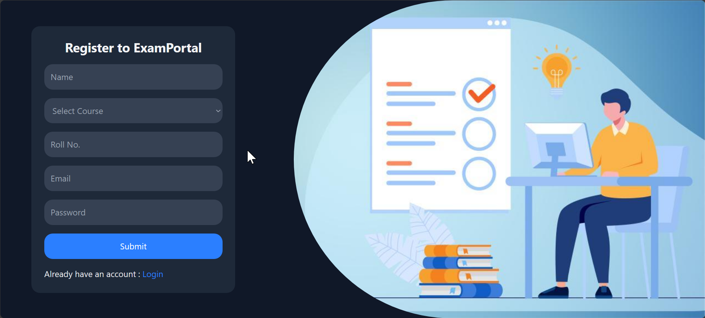

### Login Page

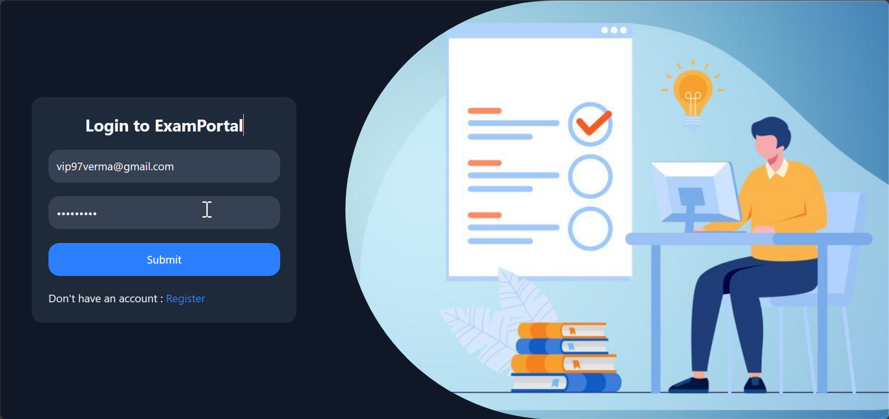

### Subjects

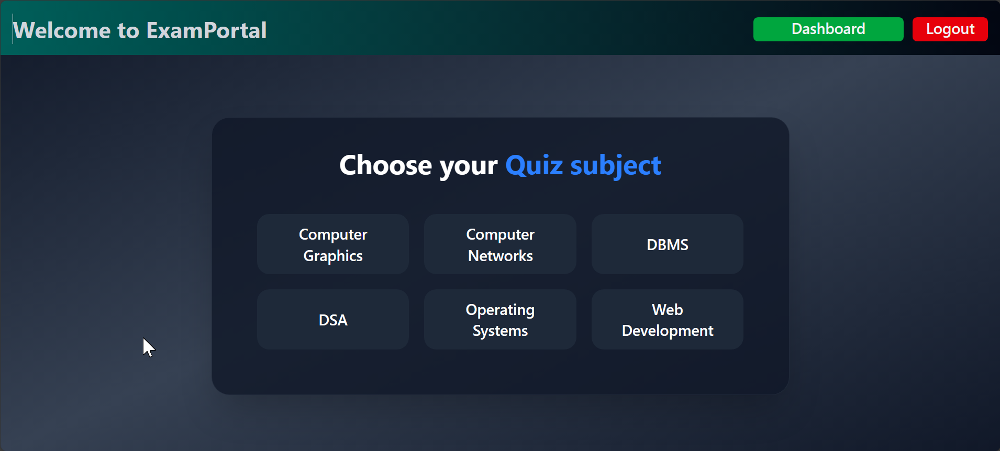

### Quiz Page

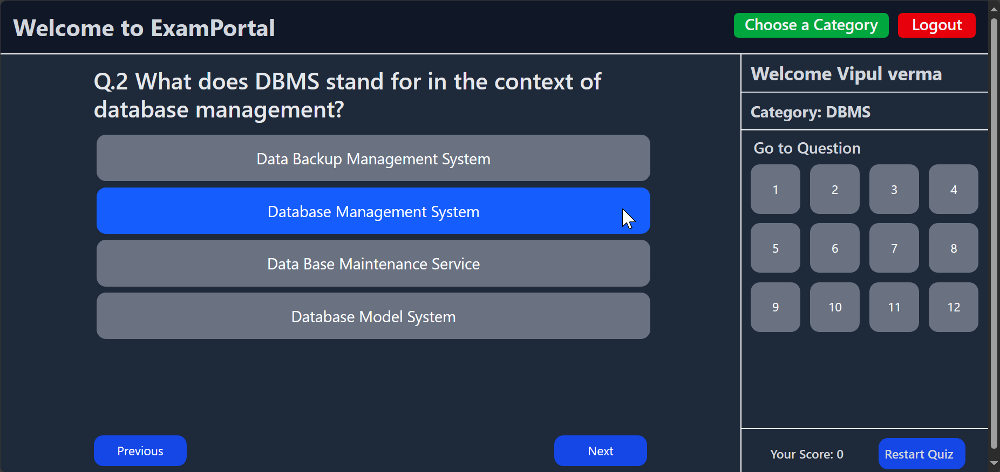

---
# Student Dashboard Pages
## Exam Summary charts
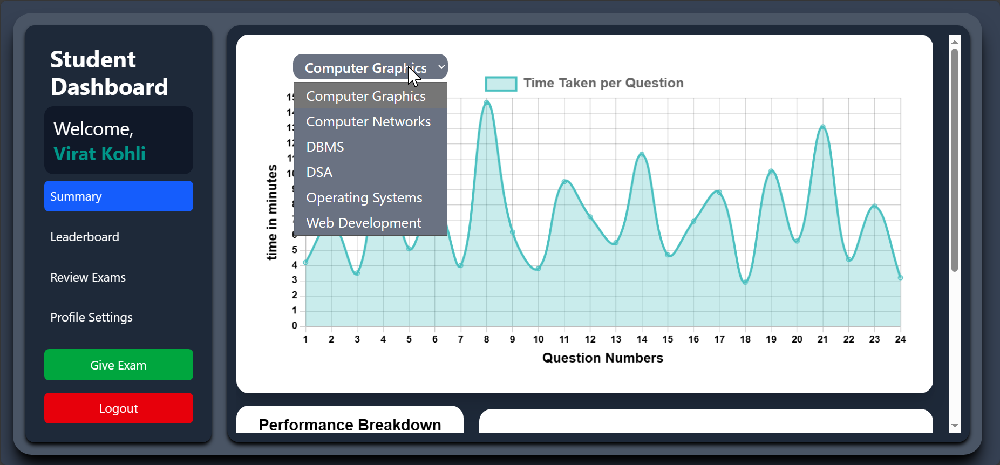
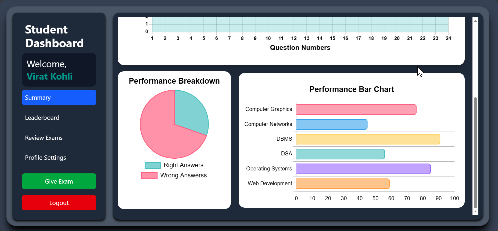

## Leaderboard page
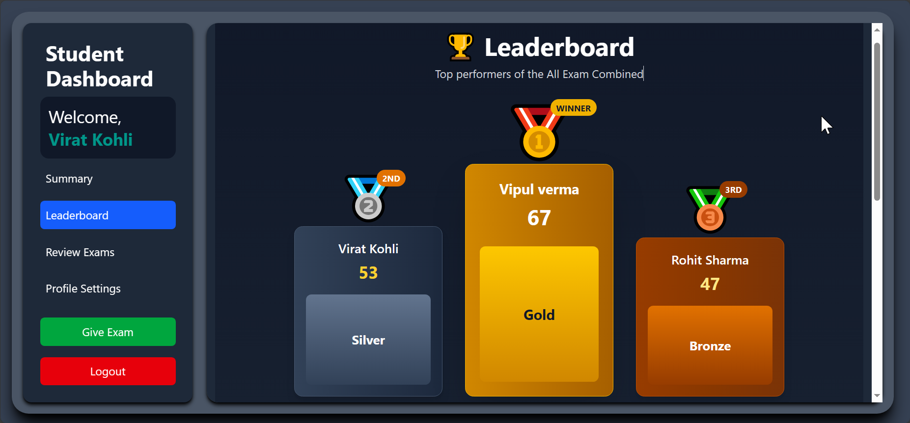
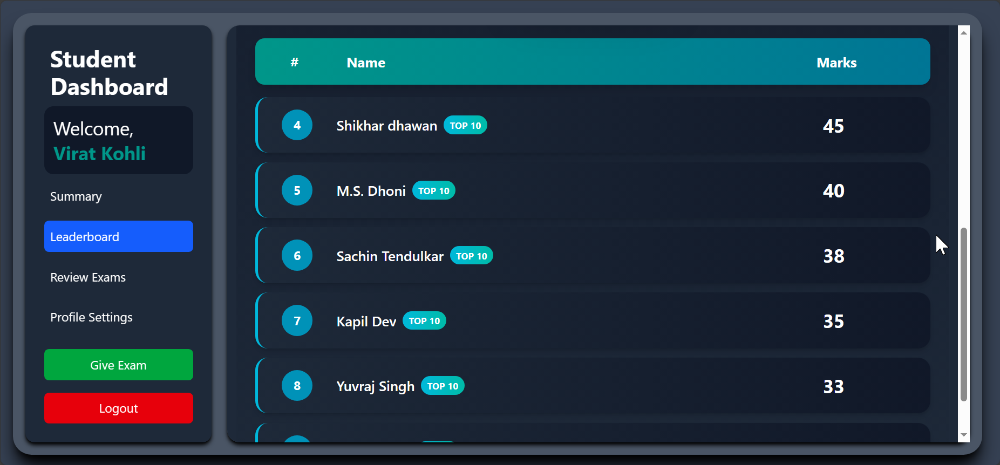

## Review Every Subjects Exam
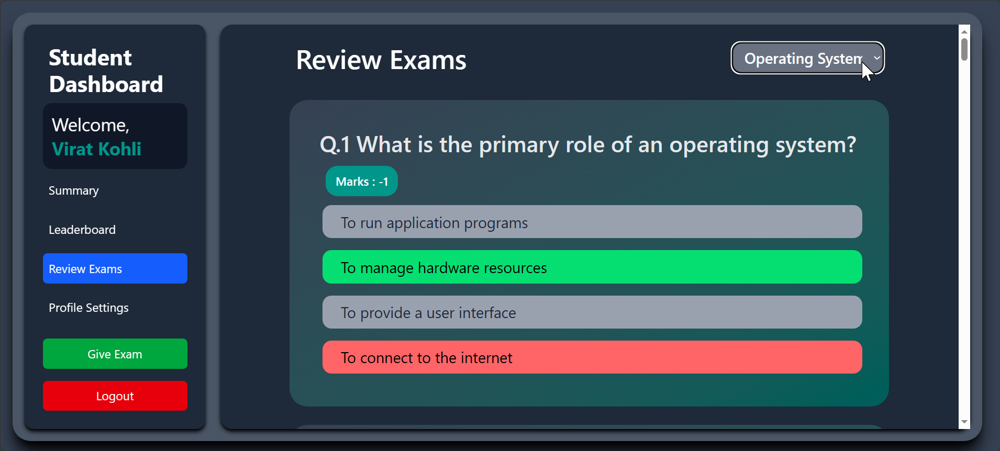

## Profile Setting
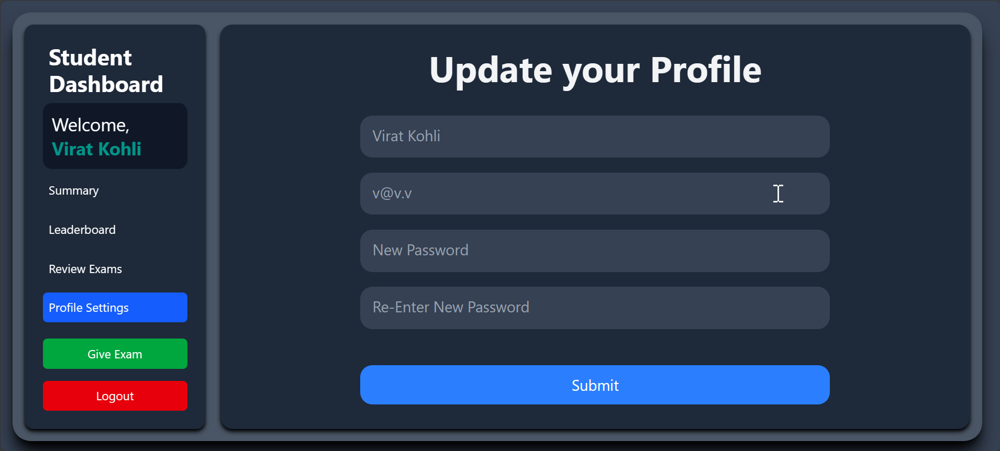

---
# Admin Dashboard Pages
## Exam Wise Data

## Leaderboard page
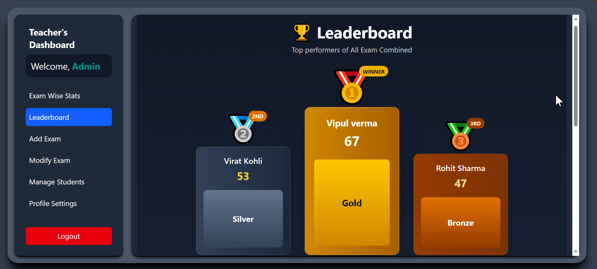
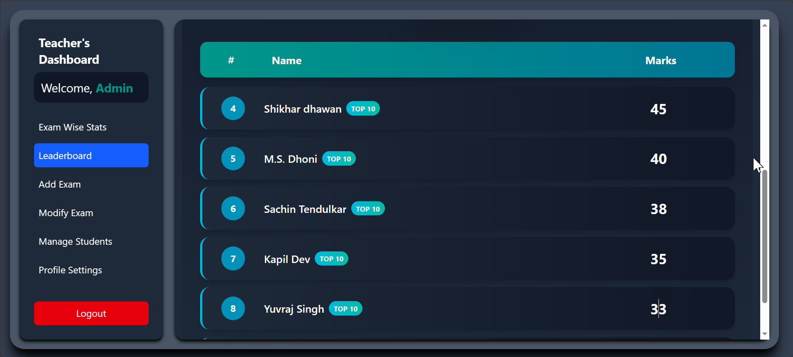

## Add Exams / Questions
### Add Questions manually
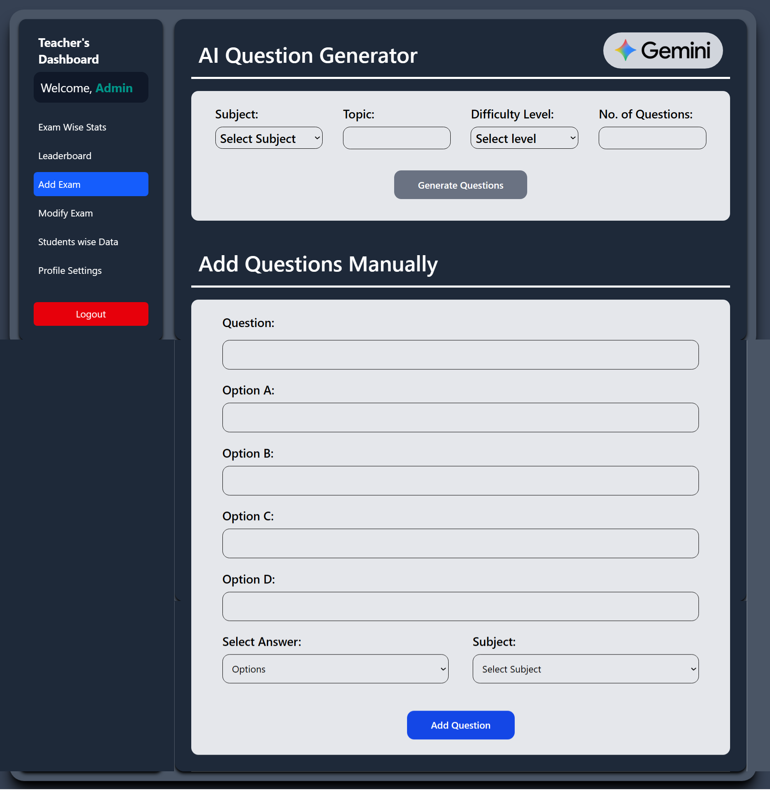

### Add Questions/Exams Using AI LLM Model- "gemini-2.5-flash"
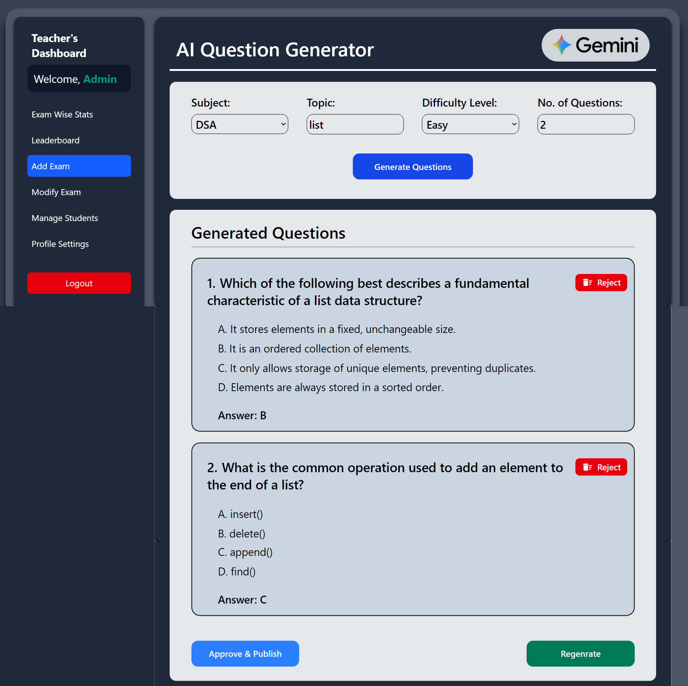

## Delete Exams / Questions 
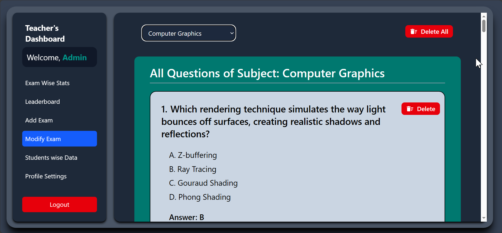

## Student Wise Data 
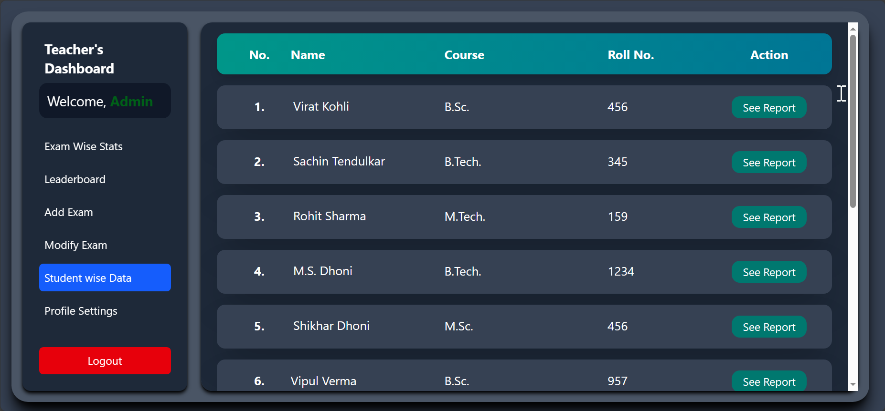
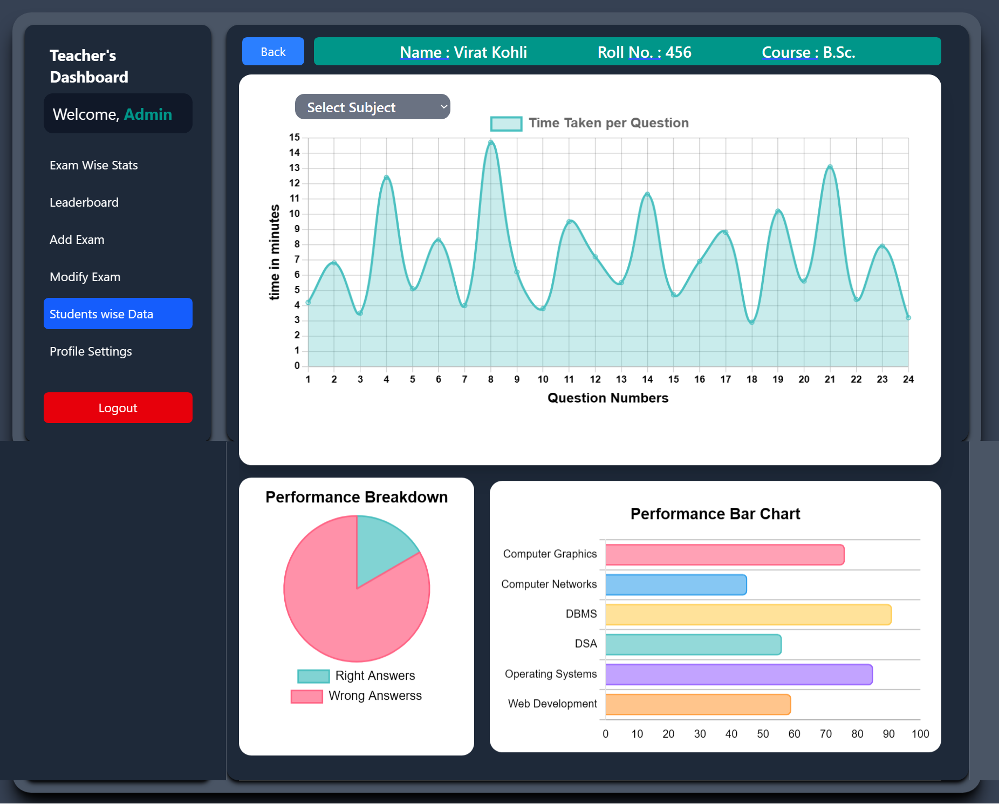

## Admin Profile Setting
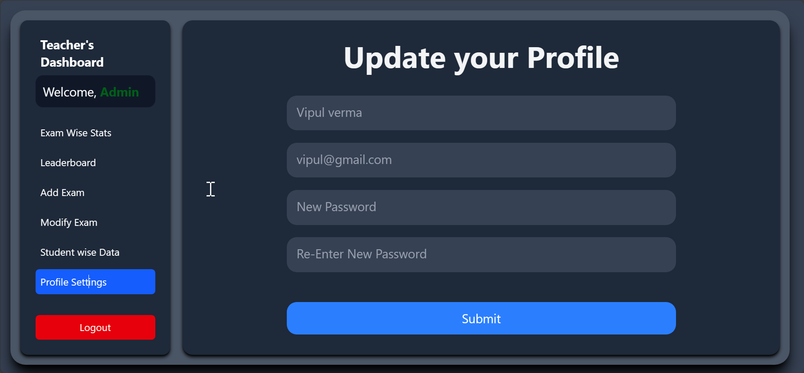

