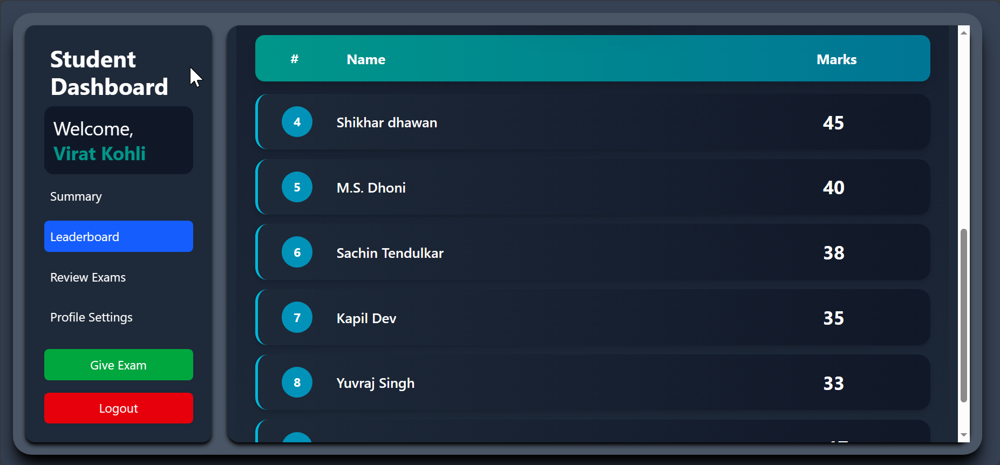
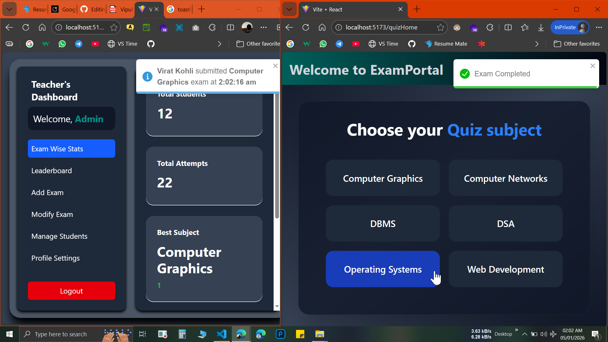
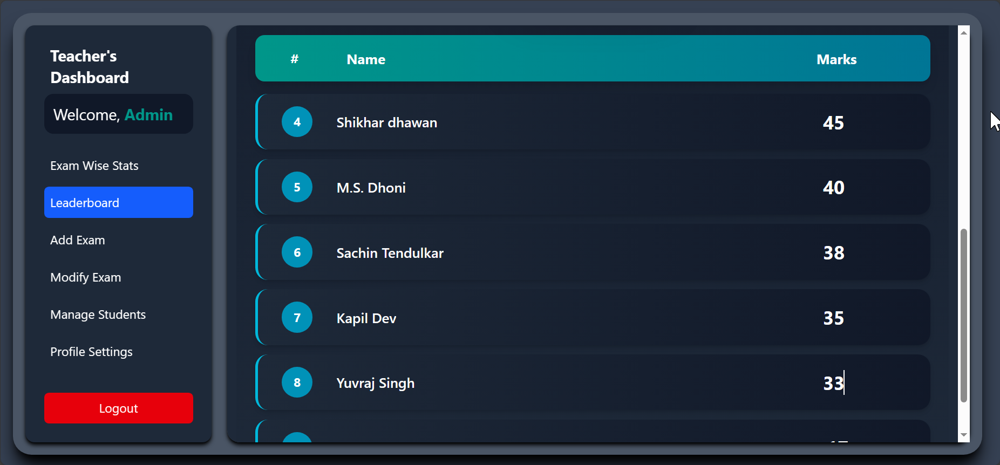

# ExamPortal

**ExamPortal** is a full-stack MERN online examination platform where students can attempt time-bound MCQ exams with per-question time tracking and detailed performance analytics. It features interactive student dashboards, leaderboards, exam review, and a powerful admin panel with advanced exam analytics and AI-based question paper generation.

---

## Features
----------

###  Student Panel

-   **Secure Authentication**

    -   Student registration and login with protected routes.

-   **Subject-Based Exams**

    -   Students can select subjects and attempt MCQ-based exams.

    -   Exam timer starts automatically when the exam begins.

    -   Time spent on **each individual question** is tracked and stored in the backend.

-   **Student Dashboard**\
    The student dashboard is divided into **four main sections**:

    #### 1. Summary & Analytics

    -   **Area Chart** -- Displays time taken per question for each subject.

    -   **Pie Chart** -- Shows total correct vs wrong answers.

    -   **Horizontal Bar Chart** -- Subject-wise performance based on marks.

    #### 2. Leaderboard

    -   Displays student rankings based on marks.

    -   Rank-wise list of top performers.

    #### 3. Exam Review

    -   Review completed exams question-by-question.

    -   Clearly highlights:

        -   Correct answers

        -   Wrong answers

        -   Marks awarded per question

    #### 4. Profile Settings

    -   Students can update personal details:

        -   Name

        -   Email

        -   Password

* * * * *

###  Admin / Teacher Panel
-   **Admin gets notification in real time when a student submitted exam using socket.io**
-   **Dashboard Summary Cards**

    -   Total number of registered students.

    -   Total exam attempts.

    -   **Best Subject** -- Subject with the highest number of passed students.

    -   **Worst Subject** -- Subject with the highest number of failed students.

-   **Exam-Wise Analytics**

    -   **Stacked Bar Chart** -- Question-wise analysis showing:

        -   Correct answers

        -   Wrong answers

        -   Skipped questions

    -   **Area Chart** -- Average time taken per question across all students.

    -   **Pie Chart** -- Overall pass vs fail distribution.

    -   **Vertical Bar Chart** -- Top 5 students for a selected subject.

-   **Leaderboard (Global)**

    -   Displays student rankings based on combined scores across all subjects.

-   **Add Exams / Question Papers**\
    Admins can create exams using **two methods**:

    -   **AI-Powered Question Paper Generator**

        -   Uses **Google Gemini 2.5 Flash LLM API**.

        -   Admin provides:

            -   Subject name

            -   Topic

            -   Difficulty level

            -   Number of questions

        -   Generates a complete question paper in seconds.

        -   Admin can review, reject, or edit questions before publishing.

    -   **Manual Question Entry**

        -   Create exams and questions manually.

-   **Modify Exams / Question Papers**

    -   Delete individual questions.

    -   Delete entire question papers.

-   **Student-Wise Performance Analysis**

    -   View detailed performance of each student using visual charts:

        -   Time taken per question

        -   Subject-wise marks

        -   Correct vs wrong answers

-   **Admin Profile Settings**

    -   Update profile details:

        -   Name

        -   Email

        -   Password

---

## Tech Stack
## Frameworks / Packages /Dependencies used
### Frontend

- **React(Vite)**
- **Redux Toolkit**
- **Tailwind CSS**
- **Axios**
- **react-icons**
- **React Router Dom**
- **react-chartjs-2**
- **react-toastify**
- **Socket-io client**

### Backend

- **Node.js**
- **Express.js**
- **MongoDB** + **Mongoose**
- **Gemini Generative AI (LLM Model- gemini-2.5-flash)**
- **Socket-io**
- **bcryptjs**
- **jsonwebtoken**
- **cookie-parser**
- **cors**
- **dotenv**
- **nodemon**
---

# Screenshots
---
### Student Registration

### Login Page

### Subjects

### Quiz Page

---
# Student Dashboard Pages
## Exam Summary charts

## Leaderboard page

## Review Every Subjects Exam

## Profile Setting

---
# Admin Dashboard Pages
## Real Time Notification Using Socket.io

## Exam Wise Data

## Leaderboard page

## Add Exams / Questions
### Generate Questions/Exams Using AI LLM Model- "gemini-2.5-flash"

### Add Questions manually

## Delete Exams / Questions 

## Student Wise Data 

## Admin Profile Setting

