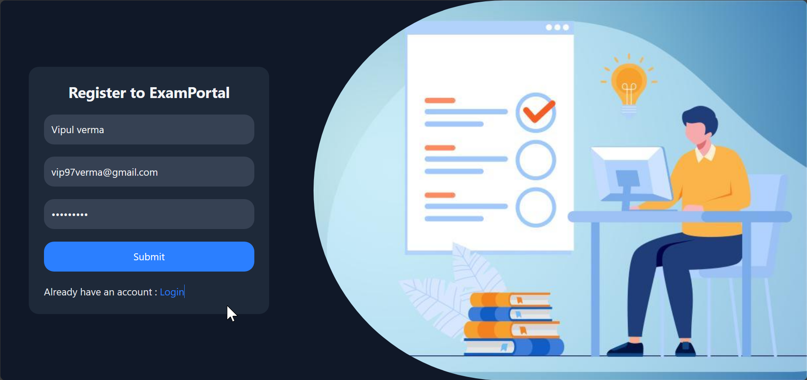

# ExamPortal

**ExamPortal** is a full-stack MERN (MongoDB, Express.js, React, Node.js) quiz application that allows students to register, log in, and attempt quizzes based on selected topics. The app provides real-time quiz navigation, scoring, and a detailed dashboard for performance tracking.

---

## Features

* Students can **register and log in** securely.
* Choose a **quiz topic** from available categories.
* Each question has **4 options** with one correct answer.
* **Next** and **Previous** buttons to navigate through questions.
* **Direct question navigation** to jump to any question quickly.
* **Dashboard** after submission:

  * Shows **correct answers, wrong answers**, and **accuracy percentage** topic-wise.
* Clean, responsive UI for smooth quiz experience.

---

## Tech Stack

### Frontend

* **React**
* **React Router DOM**
* **Tailwind CSS**
* **Axios**
* **react-toastify**

### Backend

* **Node.js**
* **Express.js**
* **MongoDB** + **Mongoose**
* **bcryptjs** 
* **jsonwebtoken** 

---

##  Screenshots

### Student Registration

### Login Page

### Categories

### Quiz Page 

### Dashboard 

### Add Questions

